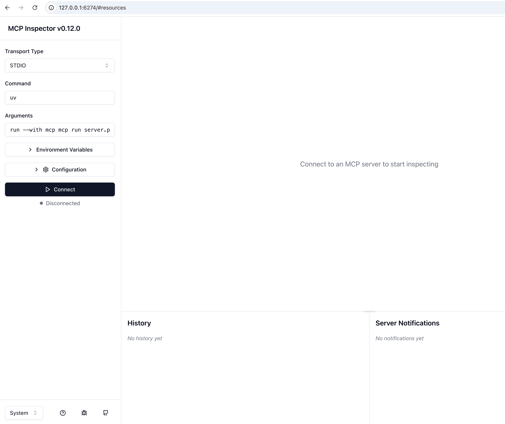
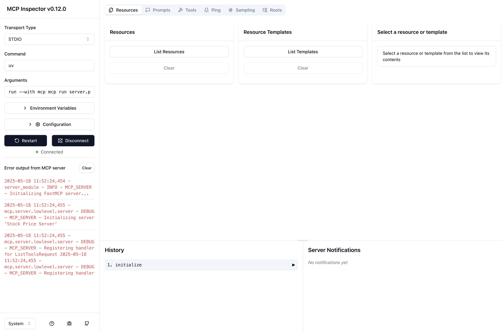
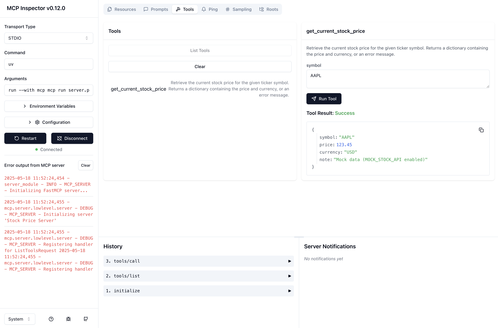

# Getting Started

This guide provides detailed instructions on how to set up, run, and test the various components of this specific Project Horizon example: the Synchronous Stock Lookup.

## 1. Running and Testing the Stock MCP Server

The Stock MCP Server (`StockToolServer`) is responsible for fetching stock price information using the `finnhub` library (previously used `yfinance`). It communicates using the Model Context Protocol (MCP) over standard input/output (stdio).

### Prerequisites

*   Ensure you have followed the main project [Installation steps](../README.md#overall-setup-for-this-example) from the example's main README.md located in this folder, especially installing dependencies from `requirements.txt`. This will make the `mcp` command-line tools available.
*   Activate your Python virtual environment:
    ```bash
    source .venv/bin/activate  # Linux/macOS
    # .venv\Scripts\activate  # Windows
    ```
*   **Finnhub API Key (Optional but Recommended):** To get real stock data, you'll need a Finnhub API key. If not provided, the server will use mock data.
    * Register for a free API key at [Finnhub.io](https://finnhub.io/)
    * Add the key to your `.env` file (located in this `examples/stock_lookup_custom_a2a/` directory): `FINNHUB_API_KEY=your_api_key_here`

### A. Running the Stock MCP Server Independently

While the Specialist Agent normally starts this server as a subprocess, you can run it directly for testing or development.

1.  **Navigate to the example directory:**
    ```bash
    *(This command assumes you are running from this example's directory: examples/stock_lookup_custom_a2a/)*
    ```
2.  **Run the server script:**
    ```bash
    python mcp_servers/stock_mcp_server/server.py
    ```
    If successful, the server will start and wait for MCP requests on its standard input. You won't see any immediate output until it receives a request. To stop it, you'd typically press `Ctrl+C` if you ran it directly in a terminal, but for testing with `mcp inspector`, the inspector will manage its lifecycle.

### B. Testing the Stock MCP Server with `mcp inspector`

The `mcp dev` command is the recommended way to test your Python-based MCP server. It starts your server script and concurrently launches the `@modelcontextprotocol/inspector`, a web-based UI for interacting with MCP servers.

**Additional Prerequisites for `mcp dev` / `@modelcontextprotocol/inspector`:**
*   **Node.js and npm/npx:** The `@modelcontextprotocol/inspector` is an npm package. `mcp dev` will typically handle its download via `npx` if it's not already available. Ensure you have Node.js installed, which includes npm (Node Package Manager) and npx (Node Package Execute).

1.  **Open a terminal** in this example's directory (`examples/stock_lookup_custom_a2a/`), with your Python virtual environment activated.

2.  **Run `mcp dev`:**
    Execute the following command, pointing to your MCP server script:
    ```bash
    mcp dev mcp_servers/stock_mcp_server/server.py
    ```
    *   **First-time use:** `mcp dev` (via `npx`) might ask for permission to download and install `@modelcontextprotocol/inspector` if it's the first time or if there's an update. For example:
        ```
        Need to install the following packages:
        @modelcontextprotocol/inspector@0.12.0
        Ok to proceed? (y)
        ```
        Type `y` and press Enter.
    *   Once started, you will see output indicating your Python server is running, a proxy server is operational, and the URL for the inspector. For example:
        ```
        INFO - MCP_SERVER - Initializing FastMCP server...
        ⚙️ Proxy server listening on port 6277
        🔍 MCP Inspector is up and running at http://127.0.0.1:6274 🚀
        ```
        *(Note: Port numbers and exact logging may vary)*

    *(Advanced Note: The `@modelcontextprotocol/inspector` can also be invoked directly using `npx @modelcontextprotocol/inspector python mcp_servers/stock_mcp_server/server.py`. However, for this project, using `mcp dev` is simpler as it manages both the server and inspector.)*

3.  **Using the MCP Inspector Web UI:**
    *   Open the Inspector URL provided in your terminal (e.g., `http://127.0.0.1:6274`). The `mcp dev` command should automatically connect the Inspector to your running `StockToolServer`.
    *   **Initial Connection:**
        *   Ideally, you'll be taken directly to a connected interface. However, if you were to encounter an initial screen asking you to manually configure the connection (similar to the image below), this would typically be for manual setups. With `mcp dev`, this screen (`../../assets/mcp-inspector-1.png`) should be bypassed.

            *Initial MCP Inspector Connection Screen (manual setup):*
            [](../../assets/mcp-inspector-1.png)

    *   **Navigating the Connected Inspector:**
        *   Once connected, you'll see an interface with a connection pane on the left (showing server status, logs, and history) and main interaction tabs in the center.
        *   The **Resources Tab** (shown below, `../../assets/mcp-inspector-2.png`) lists data resources from the server. For the `StockToolServer`, which mainly provides tools, this tab might not show much specific content but illustrates the general layout once connected. The "History" section at the bottom will show initialization calls.

            *MCP Inspector - Resources Tab (example of a connected view):*
            [](../../assets/mcp-inspector-2.png)

        *   **Testing with the Tools Tab:**
            *   The primary tab for testing the `StockToolServer` is the **Tools Tab**.
            *   Select it, and you should see the `get_current_stock_price` tool listed.
            *   Click on `get_current_stock_price`. You can then input a `ticker_symbol` (e.g., "AAPL") and click "Run Tool", as illustrated below (`../../assets/mcp-inspector-3.png`).
            *   The results will appear in the "Tool Result" section, showing the JSON response from the server.

            *MCP Inspector - Tools Tab (calling get_current_stock_price and viewing results):*
            [](../../assets/mcp-inspector-3.png)

    *   **Further Details:**
        *   The MCP Inspector has many other features for in-depth debugging and interaction with MCP servers, including detailed views for prompts, server notifications, and more.
        *   For a comprehensive understanding of all its capabilities, please refer to the official **[MCP Inspector Documentation](https://modelcontextprotocol.io/docs/tools/inspector)**.

4.  **Goal of Testing:**
    Verify that the `get_current_stock_price` tool functions correctly. Call it with a valid stock ticker and check if the response contains the expected data structure (price, currency, symbol). Test with a mock symbol if `MOCK_STOCK_API` is enabled to see the mock data.

5.  **Stopping the Server and Inspector:**
    *   To stop the `StockToolServer` and the `mcp dev` proxy/inspector, go back to your terminal where you ran the `mcp dev` command and press `Ctrl+C`.

This confirms that your `StockToolServer` is working correctly and can respond to MCP requests via the `mcp dev` environment. The next steps in this guide will cover running the other components that interact with this server. 

## 2. Running and Testing the Specialist Agent (StockInfoAgent A2A Server)

The `StockInfoAgent` is a specialist agent responsible for handling stock information requests. It acts as an Agent-to-Agent (A2A) server, receiving tasks from the main Host Agent. Internally, it uses its own ADK agent instance, which in turn utilizes the `StockToolServer` (via MCP) to fetch actual stock data. This specialist agent launches and manages the `StockToolServer` as a subprocess.

### Prerequisites

*   **Virtual Environment:** Ensure your Python virtual environment (`.venv`) is activated:
    ```bash
    source .venv/bin/activate  # Linux/macOS
    # .venv\Scripts\activate  # Windows
    ```
*   **`.env` Configuration:** Your `.env` file in this example's directory (`examples/stock_lookup_custom_a2a/`) must be correctly configured with the following key variables for the `StockInfoAgent`:
    *   `STOCK_INFO_AGENT_A2A_SERVER_HOST`: The host address the A2A server will bind to (e.g., `127.0.0.1`).
    *   `STOCK_INFO_AGENT_A2A_SERVER_PORT`: The port the A2A server will listen on (e.g., `8001`).
    *   `STOCK_INFO_AGENT_MODEL`: The Gemini model to be used by the ADK agent within the specialist (e.g., `gemini-1.0-pro`).
    *   `STOCK_MCP_SERVER_PATH`: The relative path to the Stock MCP Server script (e.g., `mcp_servers/stock_mcp_server/server.py` relative to this example's directory), which this agent will run as a subprocess.
    *   `FINNHUB_API_KEY`: (Optional but recommended) Your Finnhub API key for real stock data. If not provided, mock data will be used.
    *   `GOOGLE_GENAI_USE_VERTEXAI`, and either `GOOGLE_API_KEY` (if `False`) or `GOOGLE_CLOUD_PROJECT`/`GOOGLE_CLOUD_LOCATION` (if `True`): For authenticating with the Gemini API for the internal ADK agent.
    *   *(Refer to `.env.example` for the full list and descriptions.)*
*   **MCP Server Not Running Separately:** You do not need to run the `StockToolServer` (from Section 1) independently. The `StockInfoAgent` will start it automatically as a subprocess.

### A. Running the Specialist Agent

1.  **Ensure you are in this example's directory** (`examples/stock_lookup_custom_a2a/`).
2.  **Run the agent script:**
    ```bash
    python -m specialist_agents.stock_info_agent
    ```
3.  **Expected Output:**
    You should see log messages indicating the A2A server is starting, followed by confirmation that it's listening on the configured host and port. It will also typically log the initialization of its internal ADK agent and the launching of the `StockToolServer` subprocess.
    Key messages to look for (details and paths may vary):
    ```log
    INFO:__main__:Starting StockInfoAgent A2A Server...
    INFO:__main__:  Host: 127.0.0.1
    INFO:__main__:  Port: 8001
    INFO:__main__:  MCP Server Script Path: mcp_servers/stock_mcp_server/server.py
    INFO:specialist_agents.stock_info_agent.task_manager:StockInfoTaskManager initialized (ADK Runner Mode). Will use MCP server at: /path/to/your/project-horizon/examples/stock_lookup_custom_a2a/mcp_servers/stock_mcp_server/server.py
    INFO:uvicorn:Uvicorn running on http://127.0.0.1:8001 (Press CTRL+C to quit)
    ```

### B. Testing the Specialist Agent

There are two main ways to test if the `StockInfoAgent` A2A server is running and correctly configured:
1.  Fetching its Agent Card via a web browser.
2.  Using the provided Python test client script for a functional test.

#### B.1. Fetching the Agent Card via Web Browser

The Agent Card provides metadata about the agent and its capabilities. It's located at a standard `.well-known` path.

1.  Ensure the `StockInfoAgent` (from section 2.A) is running in a separate terminal.
2.  **Open your web browser**.
3.  **Navigate to the Agent Card URL:**
    Use the host and port configured in your `.env` file for `STOCK_INFO_AGENT_A2A_SERVER_HOST` and `STOCK_INFO_AGENT_A2A_SERVER_PORT`.
    The standard path is `/.well-known/agent.json`.
    For example, if your agent is running on `http://127.0.0.1:8001`, the URL will be:
    ```
    http://127.0.0.1:8001/.well-known/agent.json
    ```
4.  **Expected Output:**
    Your browser should display a JSON response containing the agent's card. The exact content will depend on its configuration, but it will look something like this:
    ```json
    {
      "name": "StockInfoAgent",
      "description": "Provides current stock price information using the yfinance library via MCP.",
      "url": "http://127.0.0.1:8001",
      "provider": {
        "organization": "ProjectHorizon"
      },
      "version": "1.0.0",
      "capabilities": {
        "streaming": false,
        "pushNotifications": false,
        "stateTransitionHistory": false
      },
      "defaultInputModes": [
        "text/plain"
      ],
      "defaultOutputModes": [
        "application/json"
      ],
      "skills": [
        {
          "id": "get_stock_price_skill",
          "name": "Get Stock Price",
          "description": "Retrieves the current price and currency for a given stock ticker symbol.",
          "tags": [
            "finance",
            "stocks",
            "price lookup"
          ],
          "examples": [
            "What is the price of GOOGL?",
            "Stock price for MSFT"
          ],
          "outputModes": [
            "application/json"
          ]
        }
      ]
    }
    ```
    *   The presence of this JSON response in your browser indicates that the `StockInfoAgent` A2A server is running and accessible.
    *   This card is what the Host Agent will fetch during its own startup to discover and learn how to communicate with this specialist agent.

#### B.2. Using the A2A Test Client Script (`tests/test_a2a_stock_client.py`)

For a more functional test that simulates sending a task to the `StockInfoAgent`, you can use the `test_a2a_stock_client.py` script. This script acts as a dedicated test harness, performing an end-to-end check of the `StockInfoAgent`'s ability to receive a task, process it (which involves invoking its internal tool via MCP), and return a structured result.

**What the script does:**

1.  **Initialization:** 
    *   Takes a stock ticker symbol (e.g., `GOOGL`) as a mandatory command-line argument.
    *   Optionally accepts `--url` for the `StockInfoAgent` (defaulting to `http://127.0.0.1:8001`) and a `--session` ID (a new one is generated if not provided).
    *   It ensures this example's directory or necessary parent directories are in Python's `sys.path` to correctly import its local `common_impl` module.
2.  **A2A Client Setup:** 
    *   Creates an instance of `A2AClient` from this example's `common_impl.client.client`, configured to target the `StockInfoAgent`'s URL.
3.  **Task Construction:**
    *   Generates a unique `task_id`.
    *   Constructs an A2A `TaskSendParams` object. This is the standard way to define a task in A2A. The payload includes:
        *   The `task_id` and `sessionId`.
        *   A `Message` object with the `role` set to "user" and the provided stock symbol embedded within a `TextPart`. This simulates how the Host Agent would phrase the query to the specialist.
4.  **Sending the Task:**
    *   Sends the `TaskSendParams` (as a JSON payload) via an HTTP POST request to the `StockInfoAgent`'s `/tasks/send` A2A endpoint.
5.  **Processing the Response:**
    *   Asynchronously awaits the `SendTaskResponse` from the `StockInfoAgent`.
    *   Checks if the response indicates an error at the A2A level.
    *   If no immediate error, it inspects the `result` field of the response, which contains the final `Task` object from the specialist.
6.  **Verifying Task Outcome and Artifacts:**
    *   Logs the final `state` of the task (e.g., `COMPLETED`, `FAILED`).
    *   If the task `COMPLETED` successfully, it iterates through any `artifacts` attached to the task result. The `StockInfoAgent` is expected to return an artifact (e.g., named `stock_data` or similar) containing a `DataPart` with the actual stock price, currency, and symbol as a JSON object.
    *   The script then logs the content of these artifacts, allowing you to verify the data.
7.  **Error Handling:**
    *   Includes `try-except` blocks to gracefully handle potential issues like `ConnectionRefusedError` (if the agent isn't running), `A2AClientHTTPError` (for other HTTP issues), `A2AClientJSONError` (if the server's response is not valid JSON), and other unexpected exceptions.

**Why this script is useful:**

*   **Beyond a simple ping:** Unlike just fetching the Agent Card, this script tests the full request-processing pipeline of the `StockInfoAgent`.
*   **End-to-end validation:** It verifies that the agent can: 
    *   Correctly receive and parse an A2A task.
    *   Trigger its internal ADK agent logic.
    *   Successfully manage and communicate with its `StockToolServer` MCP subprocess.
    *   Receive the data back from the MCP server.
    *   Package the final result into the correct A2A `Artifact` format and send it back.
*   **Independent testing:** It allows you to confirm the `StockInfoAgent` is fully operational before attempting to integrate it with the main Host Agent and the UI, simplifying troubleshooting.

**How to run it:**

1.  Ensure the `StockInfoAgent` (from section 2.A) is running in a separate terminal.
2.  **Open a new terminal** in this example's directory (`examples/stock_lookup_custom_a2a/`), with your Python virtual environment activated:
    ```bash
    source .venv/bin/activate  # Linux/macOS
    # .venv\Scripts\activate  # Windows
    ```
3.  **Run the test script:**
    You need to provide a stock symbol as an argument. You can also specify the agent's URL and a session ID if needed (though defaults are provided).
    ```bash
    python tests/test_a2a_stock_client.py <STOCK_SYMBOL>
    ```
    For example, to test with the symbol "GOOGL":
    ```bash
    python tests/test_a2a_stock_client.py GOOGL
    ```
    To specify a different URL (if your agent isn't running on `http://127.0.0.1:8001`):
    ```bash
    python tests/test_a2a_stock_client.py GOOGL --url http://<your_agent_host>:<your_agent_port>
    ```
4.  **Expected Output:**
    The script will log its actions, including the generated task ID, session ID, and the full response from the A2A server. If successful, you should see logs indicating the task completed and the stock data artifact:
    ```
    INFO:     A2A_TEST_CLIENT - No session ID provided, generated one: test_session_xxxxxxxx
    INFO:     A2A_TEST_CLIENT - Creating A2A task yyyyyyyyyyyyyyyy for session test_session_xxxxxxxx with symbol 'GOOGL'
    INFO:     A2A_TEST_CLIENT - Sending task to A2A server at http://127.0.0.1:8001...
    INFO:     A2A_TEST_CLIENT - Received response from A2A server.
    INFO:     A2A_TEST_CLIENT - Task yyyyyyyyyyyyyyyy final state: COMPLETED
    INFO:     A2A_TEST_CLIENT - Task completed successfully.
    INFO:     A2A_TEST_CLIENT - Artifacts received:
    INFO:     A2A_TEST_CLIENT - - Artifact Name: stock_data
    INFO:     A2A_TEST_CLIENT -   DataPart Content: {
      "price": 2735.70, // Example price
      "currency": "USD",
      "symbol": "GOOGL"
    }
    ```
    If the agent is not running or there's an issue, the script will output error messages (e.g., connection refused, HTTP error, task failed).

    **Note on Mock Data:** If you haven't provided a Finnhub API key in your `.env` file, the tool will return mock data (price: 123.45). This is useful for testing without an API key, but not for production use.

4.  **Stopping the Specialist Agent:**
    *   Go back to the terminal where the `StockInfoAgent` is running and press `Ctrl+C`.
    *   This will also terminate the `StockToolServer` subprocess that it launched.

If you can successfully retrieve the Agent Card, your `StockInfoAgent` is likely set up correctly and ready to receive tasks. The next step in a full system test would be to run the Host Agent, which will interact with this Specialist Agent.

## 3. Running the ADK Live Server (Host Agent) and Performing an End-to-End Test

This final section explains how to run the main ADK Live Server, which hosts the "Host Agent". This agent orchestrates the user interaction (including voice via the Gemini Live API) and delegates tasks to specialist agents like the `StockInfoAgent` using A2A communication. This section will guide you through an end-to-end test of the entire system.

### Prerequisites

1.  **Specialist Agent MUST Be Running:**
    *   Before starting the ADK Live Server (Host Agent), ensure that the `StockInfoAgent` (Specialist Agent from Section 2.A) is already running in its own terminal. The Host Agent needs to discover and communicate with it.
2.  **Virtual Environment:**
    *   Ensure your Python virtual environment (`.venv`) is activated in the terminal where you will run the Live Server:
        ```bash
        source .venv/bin/activate  # Linux/macOS
        # .venv\Scripts\activate  # Windows
        ```
3.  **`.env` Configuration:**
    *   Your `.env` file in this example's directory (`examples/stock_lookup_custom_a2a/`) must be correctly configured. Key variables for the ADK Live Server / Host Agent include:
        *   `LIVE_SERVER_HOST`: The host for the ADK Live Server (e.g., `127.0.0.1`).
        *   `LIVE_SERVER_PORT`: The port for the ADK Live Server (e.g., `8000`).
        *   `LIVE_SERVER_MODEL`: The Gemini model compatible with the Live API for the Host Agent (e.g., `gemini-1.5-flash-latest` or a specific Live-enabled version).
        *   `SPECIALIST_AGENT_BASE_URLS`: **Crucial.** A comma-separated list of base URLs for all specialist A2A agents that the Host Agent should discover. For the `StockInfoAgent`, if it's running on `http://127.0.0.1:8001`, this list should include that URL (e.g., `SPECIALIST_AGENT_BASE_URLS=http://127.0.0.1:8001`).
        *   `GOOGLE_GENAI_USE_VERTEXAI`, and corresponding `GOOGLE_API_KEY` or Google Cloud project details: For the Host Agent's Gemini API access.
        *   *(Refer to `.env.example` for the full list and descriptions.)*

### A. Running the ADK Live Server (Host Agent)

1.  **Ensure you are in this example's directory** (`examples/stock_lookup_custom_a2a/`).
2.  **Run the Live Server script:**
    ```bash
    python -m app.live_server
    ```
3.  **Expected Terminal Output:**
    You should see a series of log messages indicating:
    *   FastAPI application startup.
    *   Initialization of the ADK system (`initialize_adk_system()`).
    *   The Host Agent (`HostAgent`) being created.
    *   **Specialist Agent Discovery:** Crucially, logs showing the Host Agent attempting to fetch Agent Cards from the URLs specified in `SPECIALIST_AGENT_BASE_URLS`. For the `StockInfoAgent`, you should see messages indicating it successfully fetched and processed its card (e.g., `INFO:host_agent.tools:Discovered specialist agent: StockInfoAgent_A2A from http://127.0.0.1:8001/.well-known/agent.json`).
    *   The dynamic system prompt for the Host Agent being populated with information about discovered tools/specialists.
    *   Uvicorn server starting and listening on the configured `LIVE_SERVER_HOST` and `LIVE_SERVER_PORT`.
    Example (key messages, details may vary):
    ```log
    INFO:     Started server process [xxxxx]
    INFO:     Waiting for application startup.
    INFO:host_agent.agent:--- Loaded Environment Variables (HostAgent) ---
    INFO:app.live_server:Initializing ADK system...
    INFO:host_agent.agent:Creating HostAgent...
    INFO:host_agent.tools:Attempting to discover specialist agents from: ['http://127.0.0.1:8001']
    INFO:host_agent.tools:Fetching agent card from http://127.0.0.1:8001/.well-known/agent.json
    INFO:host_agent.tools:Discovered specialist agent: StockInfoAgent (StockInfoAgent_A2A) from http://127.0.0.1:8001/.well-known/agent.json
    INFO:host_agent.tools:Successfully discovered 1 specialist agents: ['StockInfoAgent']
    INFO:host_agent.agent:HostAgent created with dynamic system instructions including 1 discovered specialists.
    INFO:app.live_server:ADK system initialized successfully.
    INFO:     Application startup complete.
    INFO:     Uvicorn running on http://127.0.0.1:8000 (Press CTRL+C to quit)
    ```
    If you see errors related to specialist agent discovery, double-check that the `StockInfoAgent` is running and that `SPECIALIST_AGENT_BASE_URLS` in your `.env` file is correct.

### B. Performing an End-to-End Test via the UI

1.  **Access the Web UI:**
    Open your web browser and navigate to the address of your ADK Live Server (e.g., `http://127.0.0.1:8000`, based on your `LIVE_SERVER_HOST` and `LIVE_SERVER_PORT` settings).
2.  **Interact with the Host Agent:**
    *   Click the "Connect" button on the webpage to establish a WebSocket connection with the ADK Live Server.
    *   Click the microphone icon. Your browser may ask for permission to use your microphone; allow it.
    *   Speak your request clearly, for example: "What is the current price of Microsoft?" or "Stock price for AAPL".
    *   Click the microphone icon again to stop recording and send the audio to the server.
3.  **Observe the Result:**
    *   **Audio Response:** You should hear the Host Agent respond with the stock price information in a spoken voice.
    *   **Terminal Logs:** Check the terminals where both the `app.live_server` (Host Agent) and `specialist_agents.stock_info_agent` (Specialist Agent) are running.
        *   **Host Agent Logs:** You should see activity related to receiving your audio, transcribing it, the LLM deciding to use the `delegate_task_to_specialist` tool, the A2A request being sent to the `StockInfoAgent`, and the A2A response being received.
        *   **Specialist Agent Logs:** You should see it receiving an A2A task, logs from its internal ADK agent processing the request (which includes launching/communicating with its `StockToolServer` MCP subprocess), and sending the A2A task response back.
    This confirms the entire end-to-end flow: UI -> ADK Live Server (Host Agent) -> A2A -> Specialist Agent -> MCP -> `yfinance` -> MCP -> Specialist Agent -> A2A -> Host Agent -> UI (audio).

### C. Stopping the System

1.  **Stop the ADK Live Server (Host Agent):**
    *   Go to the terminal where `app.live_server` is running and press `Ctrl+C`.
2.  **Stop the Specialist Agent:**
    *   If you are finished testing, go to the terminal where `specialist_agents.stock_info_agent` is running and press `Ctrl+C`. This will also stop the `StockToolServer` subprocess it was managing.
3.  **Stop the MCP Inspector (if running):**
    *   If you still have `mcp dev` (from Section 1) running in a terminal, press `Ctrl+C` there as well.

Congratulations! If you've reached this point and successfully performed an end-to-end test, you have the core Project Horizon system up and running. 