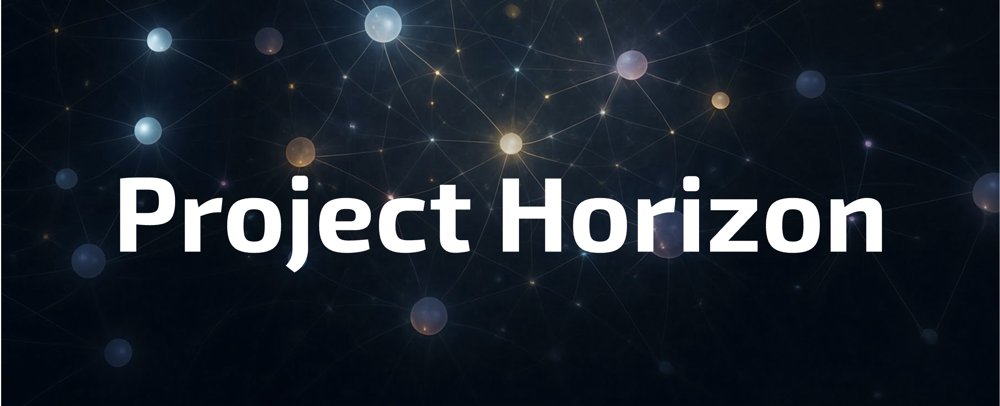
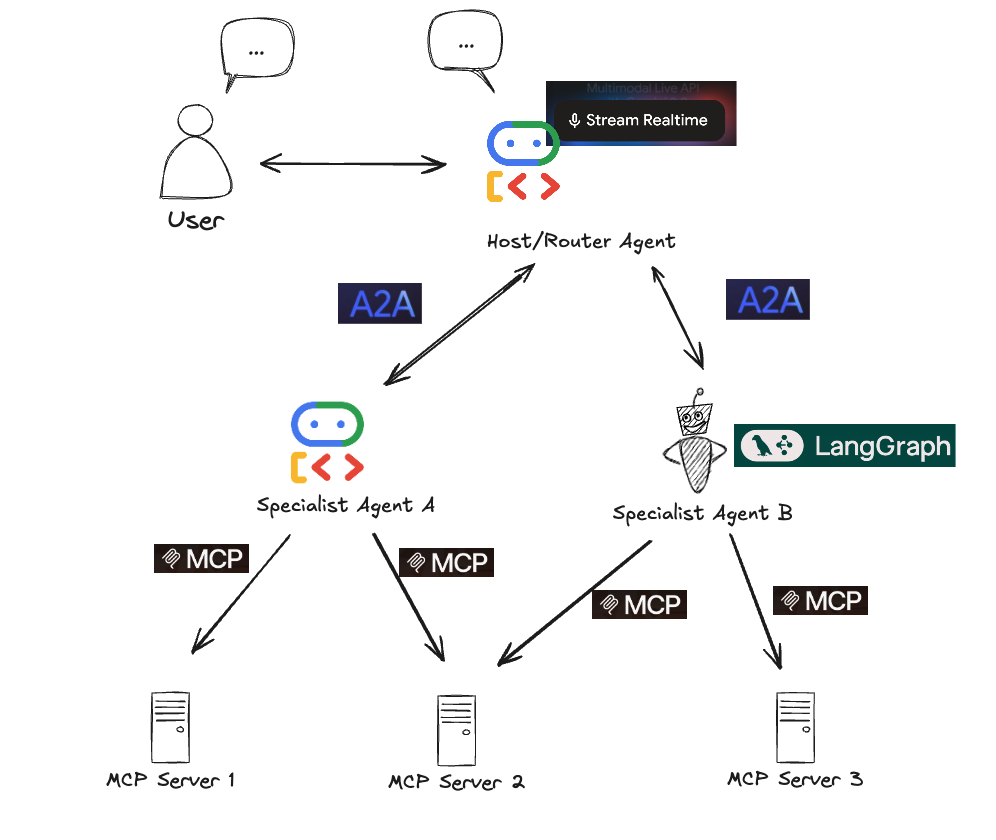
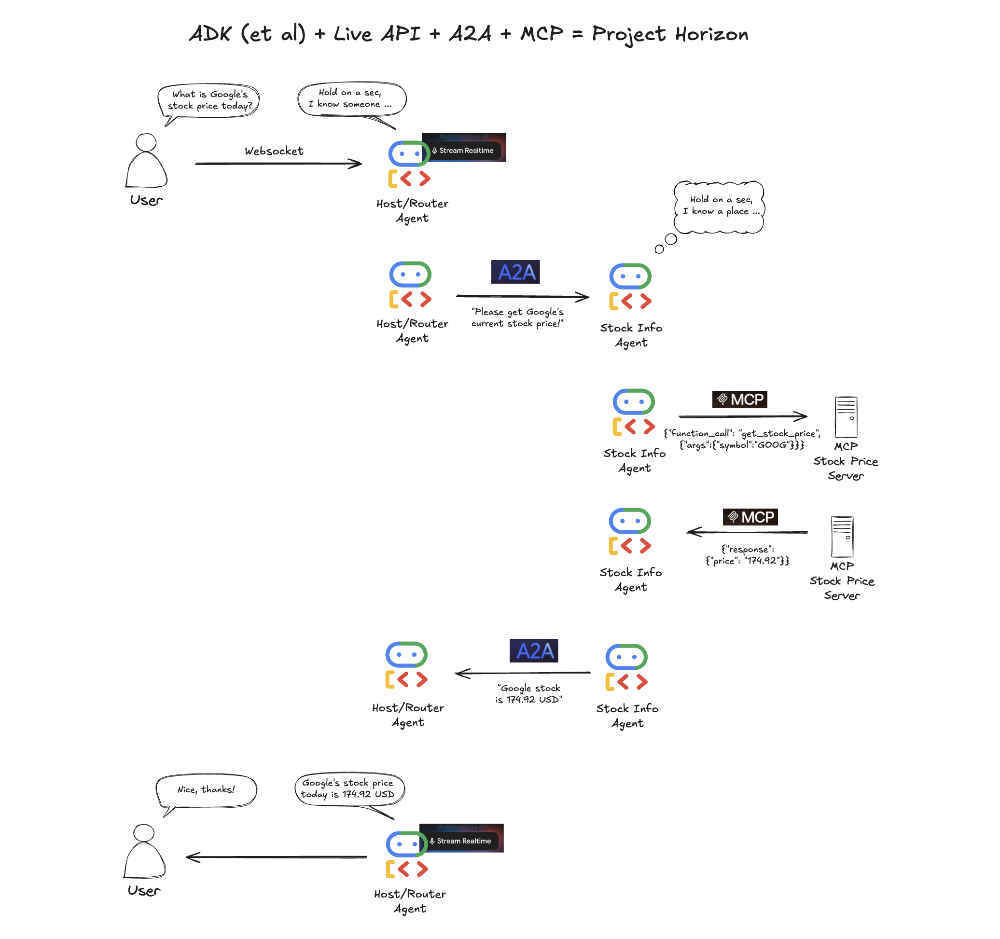

# Example: Synchronous Stock Price Lookup (Custom A2A/MCP)

**This example demonstrates a real-time stock price lookup using Google's Agent Development Kit (ADK) with the Gemini Live API, a custom A2A (Agent2Agent) protocol implementation for delegation, and a custom MCP (Model Context Protocol) client for tool execution over stdio.**

**Note:** This example uses a custom implementation of A2A and MCP client/server components and has its dependencies pinned in its local `requirements.txt` file for reproducibility. Newer examples in this repository will utilize the official `a2a-sdk`.

---
 
<!-- Path to asset is now relative to the example's README location -->
---

## Overview of this Example

This proof-of-concept demonstrates the powerful synergy between ADK (leveraging the Gemini Live API), a custom A2A protocol layer, and a custom MCP layer.

 
<!-- Adjust path if this image is specific or general -->

This specific example focuses on:

*   Integrating ADK for real-time, interactive user experiences (voice, text).
*   A bespoke implementation for standardized communication between a "Host Agent" and a "Specialist Agent" (A2A).
*   A bespoke implementation for enabling a Specialist Agent to securely interact with an external tool (an MCP Server providing stock data).

## Scenario: Real-Time Stock Price Lookup (v0.1.1 - Synchronous)

The flow demonstrated is a synchronous, end-to-end request for a stock price.

**User Interaction:**
The user interacts with the Host Agent via a simple web UI, primarily using voice input. They ask for the current price of a stock (e.g., *"What is the price of Microsoft?"*).

**Execution Flow:**

0.  **Server Startup & Initialization (FastAPI & ADK):**
    *   When `app/live_server.py` (within this example directory) is started, the FastAPI application initializes.
    *   `startup_event` calls `initialize_adk_system()`.
        *   This initializes the `HostAgent` and discovers the `StockInfoAgent` using its Agent Card (fetched via HTTP).
        *   The global ADK `Runner` instance is initialized with this configured `HostAgent`.
    *   The FastAPI server then accepts WebSocket connections.

1.  **Input (ADK Live):** Frontend captures audio, streams to `app/live_server.py`.
2.  **Host Agent Processing (ADK):** `HostAgent` (Gemini Live model) processes input, identifies intent (stock lookup) and ticker (e.g., "MSFT").
3.  **Tool Invocation (ADK -> Custom A2A Client):** `HostAgent` uses `delegate_task_to_specialist` tool with specialist name "StockInfoAgent" and "MSFT".
4.  **Delegation (Custom A2A Request):** The tool (in `host_agent/tools.py`) acts as an A2A client, looks up "StockInfoAgent", gets its A2A endpoint from the discovered Agent Card, and sends an A2A task via HTTP POST to the `StockInfoAgent`.
5.  **Task Reception (Custom A2A Server):** `StockInfoAgent` (`specialist_agents/stock_info_agent/__main__.py`), as an A2A Server, receives and parses the task.
6.  **ADK Agent Execution (within A2A Server):** `StockInfoTaskManager` instantiates its ADK `stock_info_agent`. This involves launching the `StockToolServer` (`mcp_servers/stock_mcp_server/server.py`) as a subprocess (managed by `MCPToolset` from ADK).
7.  **MCP Tool Call (via ADK Agent & Toolset):** The `stock_info_agent` uses its `get_current_stock_price` tool (loaded via MCP). The `MCPToolset` sends an MCP `tools/call` request to the `StockToolServer` subprocess via stdio.
8.  **Tool Execution (MCP Server):** `StockToolServer` (FastMCP) receives the request, uses `yfinance` for stock data.
9.  **MCP Response (stdio):** `StockToolServer` sends the result back via stdout.
10. **ADK Agent Receives Tool Result:** `MCPToolset` gets the response. `StockInfoTaskManager` extracts the data. The `StockToolServer` subprocess is terminated.
11. **Task Completion (Custom A2A Response):** `StockInfoTaskManager` formats the data into an A2A Artifact and sends it as the HTTP response to the Host Agent.
12. **Tool Result (Custom A2A Client -> ADK):** `delegate_task_to_specialist` tool in `HostAgent` gets the A2A response.
13. **Final Response Generation (ADK):** `HostAgent` formulates a natural language response.
14. **Audio Output (ADK Live):** ADK synthesizes text to audio.
15. **Streaming Output (ADK Live -> UI):** Audio streams to the UI.


<!-- Ensure this path is correct, or if flow.png is general, it's fine. -->

**This flow validates the core integration points between ADK Live, the custom A2A layer (with dynamic agent card discovery), and the custom MCP layer (over stdio) in a synchronous workflow.**

## Getting Started with THIS Example

### Prerequisites

*   Python (>= 3.9, due to MCP library requirements for this example).
*   `pip` (Python package installer).
*   Git.
*   Access to Google Cloud / Google AI Studio (for Gemini API Key/Credentials).
*   An API key for a Gemini model supporting the Live API (e.g., `gemini-2.0-flash-live-001`).
*   Familiarity with `asyncio` and FastAPI.

### Setup Steps

1.  **Navigate to this Example Directory:**
    If you are at the root of the `project-horizon` repository, navigate here:
    ```bash
    cd examples/stock_lookup_custom_a2a
    ```

2.  **Set up Virtual Environment:**
    It's highly recommended to use a virtual environment for this example.
    ```bash
    python -m venv .venv
    source .venv/bin/activate  # Linux/macOS
    # .venv\Scripts\activate  # Windows
    ```

3.  **Install Dependencies for this Example:**
    This example has its own `requirements.txt` with pinned versions.
    ```bash
    pip install -r requirements.txt
    ```

4.  **Configure Environment Variables (`.env`):**
    *   In this directory (`examples/sync-stock-lookup-custom-a2a/`), copy `.env.example` to a new file named `.env`:
        ```bash
        cp .env.example .env
        ```
    *   Open the `.env` file and populate it with your specific configuration values (API keys, ports, etc.). Refer to the comments within `.env.example`.
        *Key variables include `GOOGLE_API_KEY`, `LIVE_SERVER_PORT`, `STOCK_INFO_AGENT_A2A_SERVER_PORT`, `STOCK_MCP_SERVER_PATH`, `MOCK_STOCK_API`.*

### Running the Demo

Execute the components in **separate terminals** from **this example's root directory** (`project-horizon/examples/sync-stock-lookup-custom-a2a/`), ensuring your virtual environment is active in each.

1.  **Terminal 1: Start Specialist Agent (StockInfoAgent A2A Server)**
    Ensure the `STOCK_MCP_SERVER_PATH` in your `.env` file is correctly set (e.g., `mcp_servers/stock_mcp_server/server.py` relative to this example's root, or an absolute path).
    ```bash
    python -m specialist_agents.stock_info_agent
    ```
    *Verify it starts listening on the port defined in `.env` (e.g., 8001).*

2.  **Terminal 2: Start ADK Live Server (Host Agent)**
    ```bash
    python -m app.live_server
    ```
    *Verify it starts, discovers the specialist agent, and listens on its port (e.g., 8000 as per `.env`).*

3.  **Access UI:**
    Open your web browser to `http://<LIVE_SERVER_HOST>:<LIVE_SERVER_PORT>` (e.g., `http://127.0.0.1:8000`, using values from your `.env`).

4.  **Interact:**
    *   Click "Connect".
    *   Click the Mic button, speak a stock request (e.g., "What is the price of Apple?").
    *   Click the Mic button again to stop recording.
    *   Listen for the audio response.
    *   Check the logs in both terminals for A2A and MCP interactions.
    *   Click "Stop" in the UI when finished.